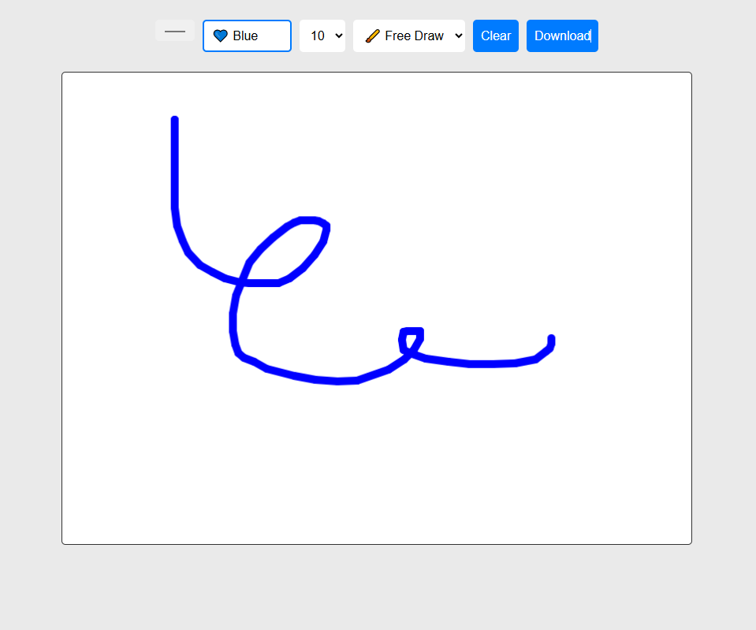

# Drawing App

## Overview

The Drawing App is a simple web-based drawing application that allows users to create drawings on a canvas. Users can select colors, brush sizes, and shapes to enhance their artwork. The application is designed to be modern, fluid, and responsive, making it accessible on various devices.

## Features

- **Color Picker**: Choose from a color picker or a predefined set of colors.
- **Brush Size**: Select the brush size for drawing.
- **Shape Options**: Draw freely or select from shapes such as rectangles, circles, and lines.
- **Bucket Tool**: Fill the entire canvas with a selected color.
- **Clear Canvas**: Reset the canvas to start a new drawing.
- **Download**: Save your artwork as an image file.

## Technologies Used

- HTML
- CSS
- JavaScript (for drawing functionality)

## Installation

1. Clone this repository to your local machine:
    ```bash
    git clone https://github.com/yourusername/drawing-app.git
    ```

2. Navigate to the project directory:
    ```bash
    cd drawing-app
    ```

3. Open `index.html` in your web browser to run the application.

## Usage

1. Use the color picker or select a color from the dropdown to choose your drawing color.
2. Select the brush size from the dropdown menu.
3. Choose a shape from the shape picker if you want to draw specific shapes.
4. Click and drag on the canvas to draw, or click the bucket tool to fill the canvas with color.
5. Use the "Clear" button to erase everything on the canvas.
6. Click the "Download" button to save your drawing as an image file.

## Screenshots



## License

This project is licensed under the MIT License. See the LICENSE file for more details.

## Contributing

If you would like to contribute to this project, please fork the repository and submit a pull request.

## Acknowledgments

- Inspired by various online drawing tools and applications.
- Thanks to all the contributors and open-source projects that provided resources for building this application.
